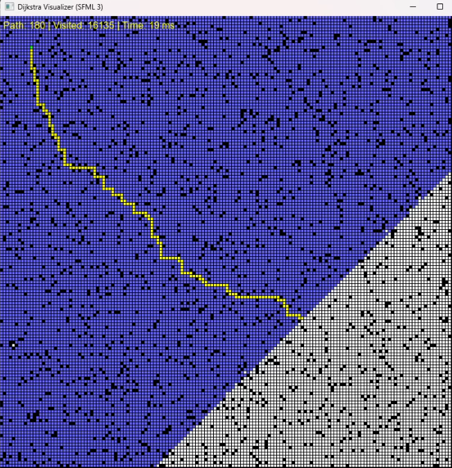

# Dijkstra Pathfinding Visualizer

Interactive randomly generated grid‑based visualizer written in **C++** using the **SFML 3.0.0**. It demonstrates real‑time Dijkstra routing across a 150 × 150 grid (22  500 nodes); it solves the shortest path in ≈ 20 ms, shows start/goal, visited cells, and the final route in real‑time, while logging performance metrics to **CSV**, and overlays live stats on screen. Optionally a **Python** program reads the data stored in the **CSV** and using **Pandas** and **MatPlotLib** libraries displays the results of all runs over time taken.

---

## Features

- **Dijkstra algorithm** with priority‑queue optimization
- Handles **15 000+** nodes in ~20 ms on a typical laptop
- Random obstacle generation (2 000 walls by default)
- **On‑screen overlay** (path length, visited nodes, elapsed ms)
- **`runs.csv`** logging – append `pathLength,visitedNodes,elapsedMs` on every run
- Minimal **Python analysis script** (`analyze_runs.py`) to plot elapsed time and show summary stats

---

## Build

```bash
# Download MinGW‑UCRT 64‑bit toolchain (MSYS2) + SFML 3
# SFML 3.0.0 directory in same directory as project
# Adjust paths if SFML is unpacked elsewhere

g++ DijkstraVisualizer.cpp -std=c++17 -I"SFML-3.0.0/include" -L"SFML-3.0.0/lib" -lsfml-graphics -lsfml-window -lsfml-system -o DijkstraVisualizer.exe
```


```
sfml-graphics-3.dll
sfml-window-3.dll
sfml-system-3.dll
arial.ttf 
```

---

## Usage

```bash
./DijkstraVisualizer.exe   #generates random walls & solves once
```



The window shows:

- **Green** start, **white** goal
- **Black** walls, **blue** visited nodes
- **Yellow** final shortest path

Stats overlay example:

```
Path: 180 | Visited: 16112 | Time: 18 ms
```

Each launch appends one line to **`runs.csv`**.

---

## Analyze runs

Install `pandas` & `matplotlib`, then:

```bash
python analyze_runs.py
```

After running, the script:

1. Loads _runs.csv_ (comma **or** tab delimited)
2. Prints summary statistics
3. Pops up a line chart of **elapsed ms** over run number

### Printed Statistics

| Statistic | path_length | visited_nodes | elapsed_ms |
| --------- | ----------: | ------------: | ---------: |
| count     |         5.0 |      5.000000 |   5.000000 |
| mean      |       180.0 |  16107.000000 |  18.900000 |
| std       |         0.0 |     27.367864 |   0.341321 |
| min       |       180.0 |  16064.000000 |  18.550000 |
| 25%       |       180.0 |  16099.000000 |  18.790000 |
| 50%       |       180.0 |  16112.000000 |  18.830000 |
| 75%       |       180.0 |  16130.000000 |  18.860000 |
| max       |       180.0 |  16130.000000 |  19.470000 |


---

## Future Plans / Ideas

- Mouse interaction to place walls / move start‑goal dynamically
- Add **A*** & BFS for algorithm comparison (toggle key)
- Frame‑by‑frame animation slider
- Export PNG of the grid & path

---

## License

MIT